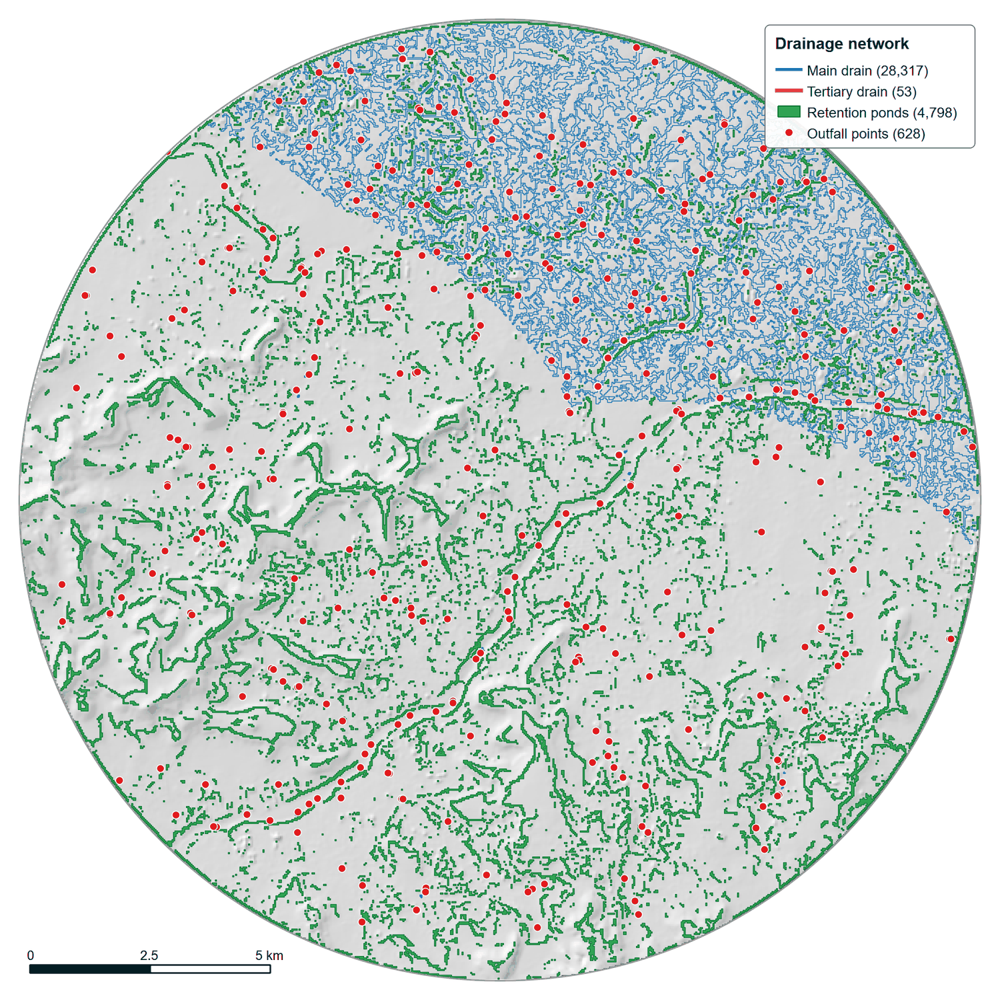
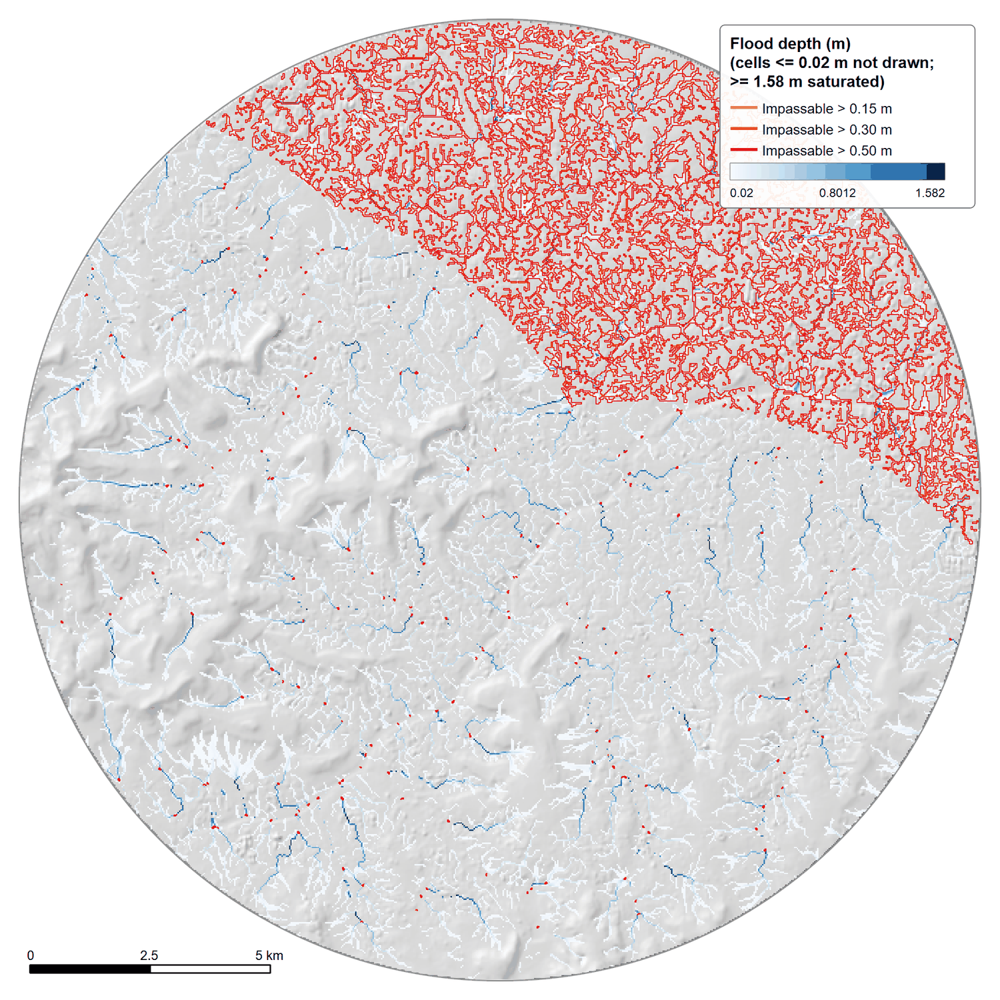

# 🖥️ Dashboard

## Live system

The repository's `index.html` is the deployed NagarBadh Drishtm dashboard.

**[Open the Dashboard →](../)**

## Purpose

The dashboard brings together the project's spatial and modelling outputs into a single decision-support interface.

The dashboard workflow includes:

- Study-area visualisation
- Event/scenario flood products
- Flood-depth information
- Drainage-network context
- Road-accessibility layers
- Modelling metadata

The images below are QGIS map exports of the layer types the dashboard presents (not screenshots of the dashboard itself).

<table><tr><td align="center" valign="top"> Drains, retention ponds and outfalls over hillshade</td><td align="center" valign="top"> SWMM V7 (3 h): links by max depth / full depth, nodes by status</td></tr></table>

<table><tr><td align="center" valign="top"> 200 m window on the flooded nodes</td><td align="center" valign="top"> Flood depth with impassable edges at 0.15 / 0.30 / 0.50 m</td></tr></table>

---

## Relationship to the repository

The repository deliberately keeps the working dashboard as the root `index.html`.

The documentation around it explains:

- how the project evolved
- how the modelling works
- where the data come from
- which research literature informed the work
- what is implemented
- what remains future work

---

## Prototype status

The dashboard should be understood together with the documented implementation scope.

Where a feature is a prototype, static export or future integration, that status should be stated explicitly rather than presented as a fully operational real-time service.
