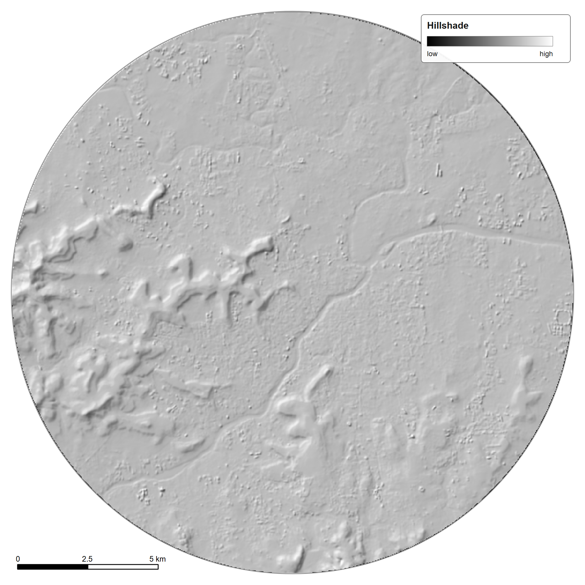

# 📚 Data and References

## Spatial data

The project uses a predominantly indigenous spatial-data foundation, including an ISRO-derived DEM in the modelling workflow.

<table><tr><td align="center" valign="top"> DEM (UTM 43N), 378 to 729 m</td><td align="center" valign="top"> Hillshade</td></tr></table>

## Core technical tools

- QGIS / PyQGIS
- EPA SWMM 5.2.4
- PySWMM
- PostgreSQL
- PostGIS
- Python

## Spatial reference framework

The project uses an EPSG:32643 / UTM Zone 43N projected framework for the Pune study area.

---

## Technical references

### EPA SWMM

Official technical reference:
https://www.epa.gov/water-research/storm-water-management-model-swmm

### QGIS

https://qgis.org/

### PostGIS

https://postgis.net/

### ISRO / NRSC Earth Observation data

https://bhuvan.nrsc.gov.in/
https://bhoonidhi.nrsc.gov.in/

### Smart India Hackathon

https://www.sih.gov.in/

---

## Master bibliography

See [references/bibliography.md](../references/bibliography.md).
