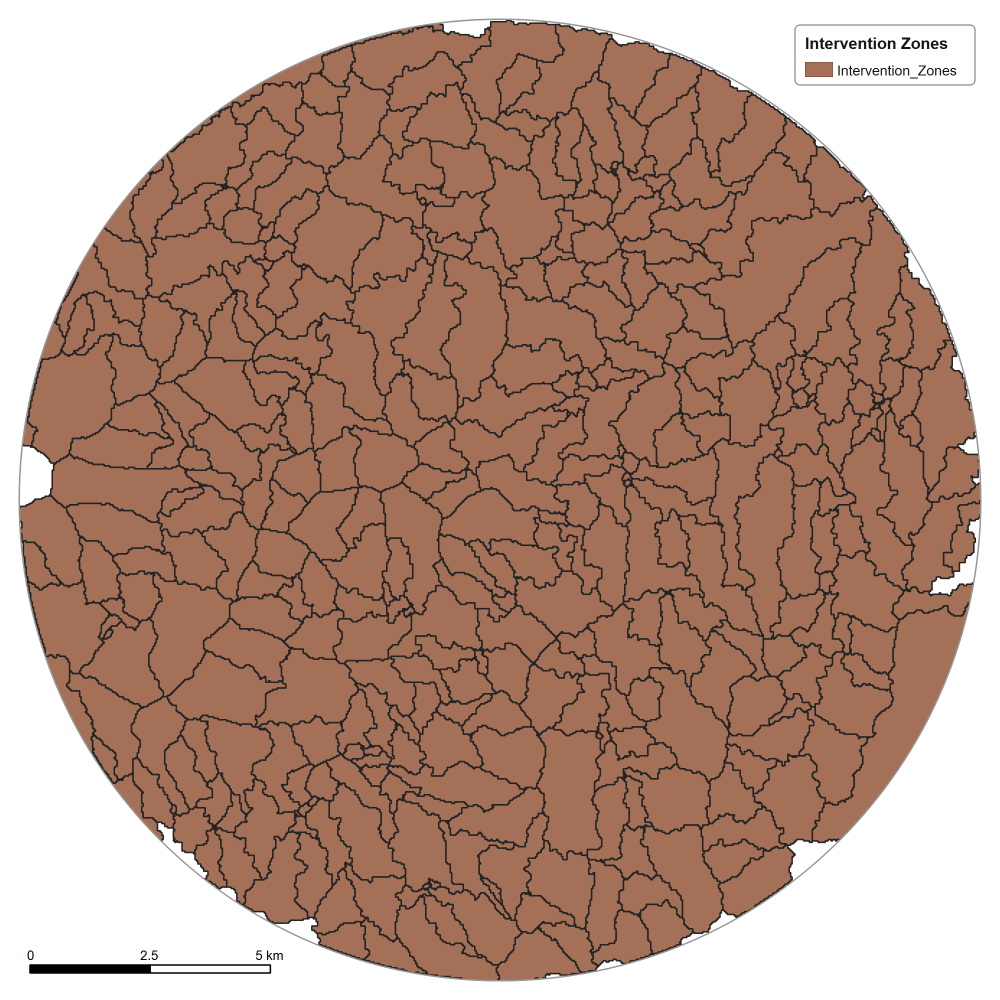

# 💧 Drainage Modelling

## Why a drainage model?

Terrain explains surface behaviour, but urban flooding is also controlled by engineered drainage infrastructure.

The project therefore represents drainage as an explicit computational network.

## Current representation

The model documentation includes:

- **28,370 drainage conduit segments**
- Nodes
- Outfalls
- Retention ponds
- Intervention zones
- Hydraulic test/analysis layers

## Network concept

```text
Rainfall / runoff
      ↓
Drainage nodes
      ↓
Conduits
      ↓
Outfalls / storage
      ↓
Hydraulic response
```

The drainage network becomes the bridge between hydro-spatial analysis and hydraulic simulation.

---

## Next layer

The drainage representation is simulated using EPA SWMM 5.2.4.

See [Hydraulic Modelling](hydraulic-modelling.md).

---

## Figures

<p align="center"><br><sub><b>Drainage design (Drainage_Design_Fixed_v2), as exported from QGIS.</b></sub></p>
<p align="center"><br><sub><b>Outfall points.</b></sub></p>
<p align="center"><br><sub><b>Retention ponds.</b></sub></p>
<p align="center"><br><sub><b>Intervention zones.</b></sub></p>
<p align="center"><br><sub><b>Drainage network overview: drains, ponds and outfalls over hillshade.</b></sub></p>
