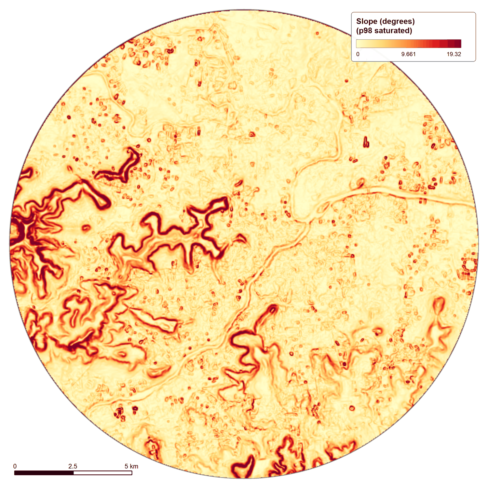

# 🗺️ Geospatial Modelling

## Purpose

The geospatial component establishes the physical and analytical representation of the urban study area.

## Core terrain workflow

```text
DEM
 ↓
Projection / spatial preparation
 ↓
Terrain conditioning
 ↓
Slope / aspect
 ↓
Flow direction
 ↓
Flow accumulation
 ↓
Hydrological indices
 ↓
Streams / watersheds
 ↓
Waterlogging / risk layers
```

## Key outputs

The project includes terrain, hydrological and risk-oriented layers such as:

- DEM and terrain derivatives
- Slope
- Aspect
- Flow direction
- Flow accumulation
- TWI
- TRI
- Watersheds
- Streams
- Drainage density
- Ponding susceptibility
- Waterlogging / risk indicators

The broader current system contains **54 GIS layers** grouped into functional categories.

---

## Spatial framework

The project uses a common projected spatial framework for integration of raster and vector modelling outputs.

The workflow includes an EPSG:32643 / UTM Zone 43N spatial framework for the Pune study area.

---

## Figures

All maps: Pune 10 km AOI (circle, r = 10 km), EPSG:32643. Colour scales are display styling applied at export; see the [Layer Gallery](layer-gallery.md) for every layer.

<p align="center"><br><sub><b>Elevation (m a.s.l.), DEM in UTM 43N: 378 to 729 m within the AOI.</b></sub></p>
<p align="center"><br><sub><b>Slope (degrees), display range 0 to p98.</b></sub></p>
<p align="center"><br><sub><b>Topographic wetness index, range 2.30 to 11.89.</b></sub></p>
<p align="center"><br><sub><b>Flow accumulation.</b></sub></p>
<p align="center"><br><sub><b>Waterlogging risk index (continuous, 1 = low, 5 = high).</b></sub></p>
