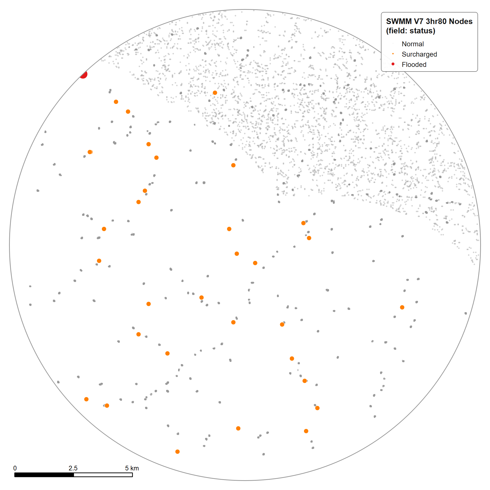
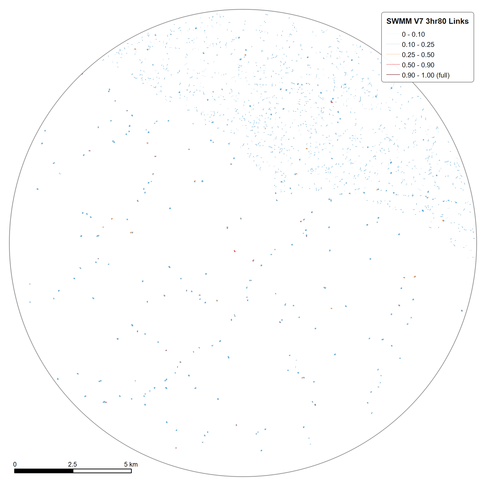

# ⚙️ Hydraulic Modelling

## EPA SWMM 5.2.4

NagarBadh Drishtm uses **EPA SWMM 5.2.4** for drainage-system hydraulic simulation, with PySWMM used in the computational workflow.

## Outputs

The workflow includes:

- Node depth
- Link flow
- Surcharge / flooding response
- Event/scenario hydraulic products

---

## Engineering workflow

The hydraulic model was not treated as a one-shot calculation.

The development cycle was:

```text
Build model
    ↓
Run simulation
    ↓
Inspect numerical behaviour
    ↓
Diagnose instability
    ↓
Correct network geometry / slopes
    ↓
Regenerate model
    ↓
Rerun
    ↓
Verify outputs
```

This iterative cycle is a central engineering part of the project.

---

## Integration with GIS

SWMM outputs are mapped back into the spatial environment so that hydraulic response can be viewed alongside terrain, drainage and flood-impact layers.

---

## Scope

The hydraulic modelling described here is part of the broader current system and is not claimed to be part of the associated unpublished manuscript unless explicitly included in that manuscript.

---

## Figures: SWMM run V7 (3 h, "3hr80")

Map exports of the SWMM run documented in the dashboard. Per the export notes: 25,232 links and 14,109 nodes; 6 flooded nodes and 60 surcharged nodes, all others normal.

<p align="center"><br><sub><b>Links by max depth / full depth, nodes by status, over hillshade.</b></sub></p>
<p align="center"><br><sub><b>Node status: normal, surcharged, flooded.</b></sub></p>
<p align="center"><br><sub><b>Link max depth / full depth classes (0 to 1.00, full).</b></sub></p>
<p align="center"><br><sub><b>200 m window on the flooded nodes.</b></sub></p>
