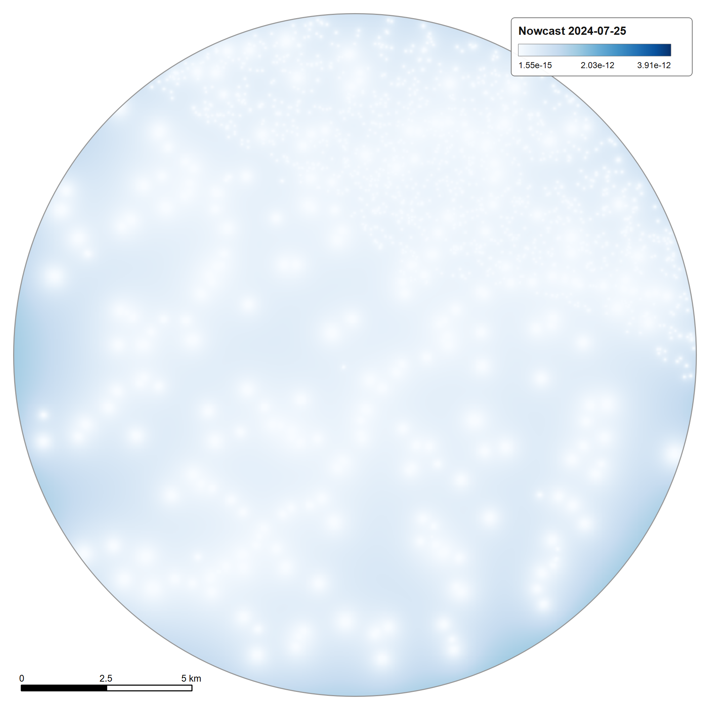

# 🌊 Inundation Modelling

## From hydraulic response to flood depth

Hydraulic simulation produces computational outputs.

For decision support, those outputs need to be represented spatially.

The project therefore connects hydraulic results to GIS flood-depth and inundation-oriented products.

```text
SWMM outputs
    ↓
Spatial mapping
    ↓
Flood depth
    ↓
Inundation representation
    ↓
Road impact
```

---

## Event / scenario outputs

The current project includes event/scenario inundation products used within the dashboard workflow.

These products support examination of flood behaviour under defined scenarios.

---

## Important distinction

Event/scenario visualisation should not be confused with a fully operational, continuously ingesting real-time forecasting service.

The repository documents implemented capabilities separately from planned or future real-time integrations.

---

## Figures

<p align="center"><br><sub><b>Flood depth (m), cells at or below 0.02 m not drawn; range 0.02 to 1.58 m.</b></sub></p>
<p align="center"><br><sub><b>Flood depth with impassable edges at 0.15 / 0.30 / 0.50 m over hillshade.</b></sub></p>

### Nowcast scenario layers

Three scenario rasters are exported as map layers: `Nowcast Cloudburst 75mm`, `Nowcast 2024-07-25` and `Nowcast 2019-09-25`. They are event/scenario products, not a continuously ingesting real-time feed (see the distinction above). The legend units of these exports are not labelled.

<p align="center"><br><sub><b>Nowcast scenario layer: Cloudburst 75mm.</b></sub></p>
<p align="center"><br><sub><b>Nowcast scenario layer: 2024-07-25.</b></sub></p>
<p align="center"><br><sub><b>Nowcast scenario layer: 2019-09-25.</b></sub></p>
