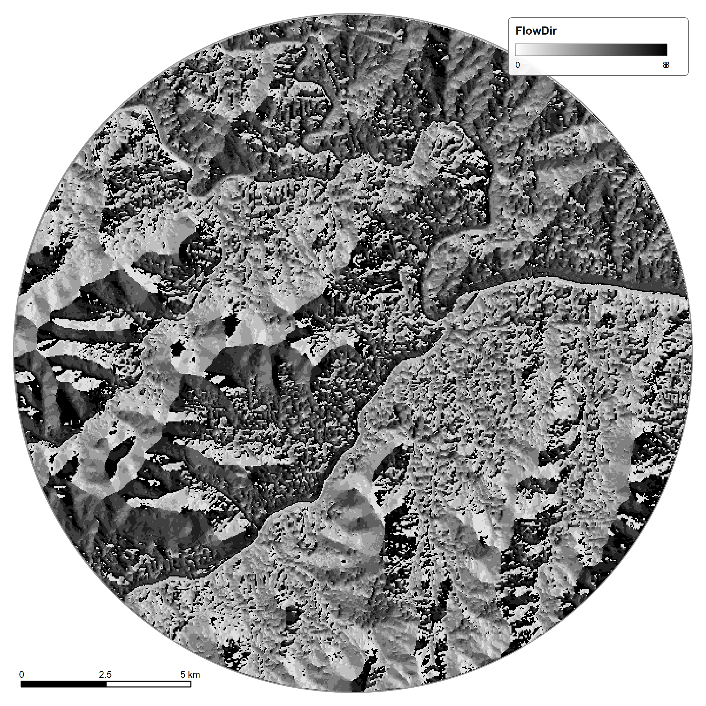
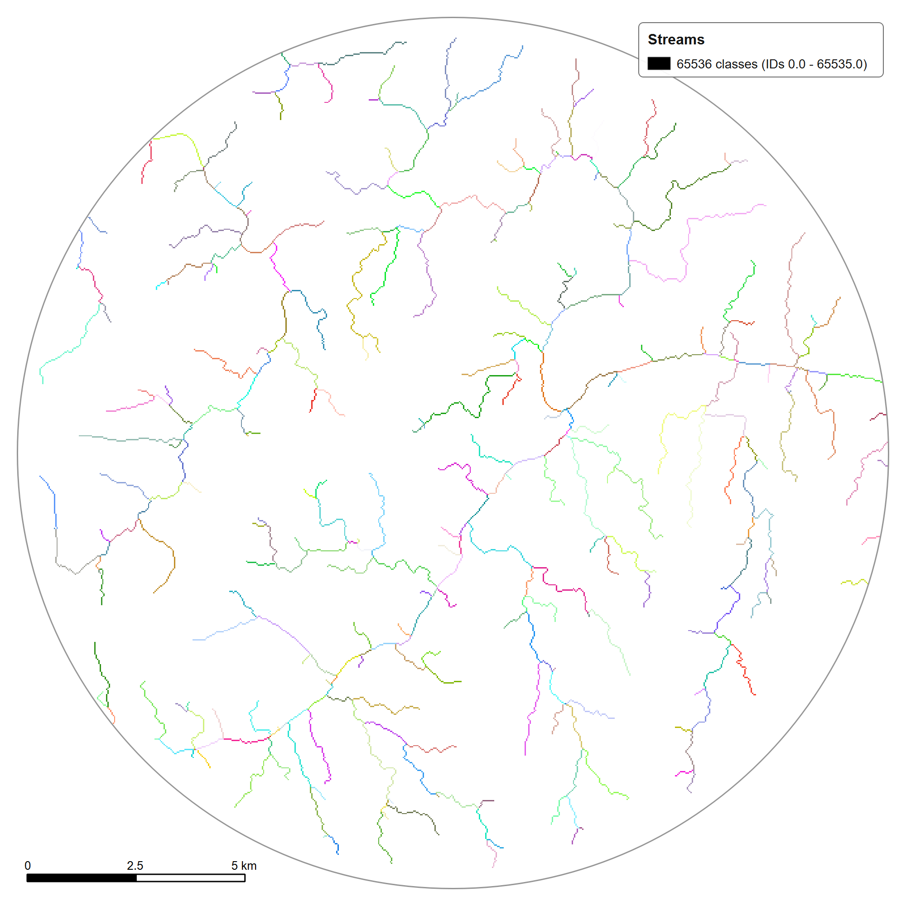
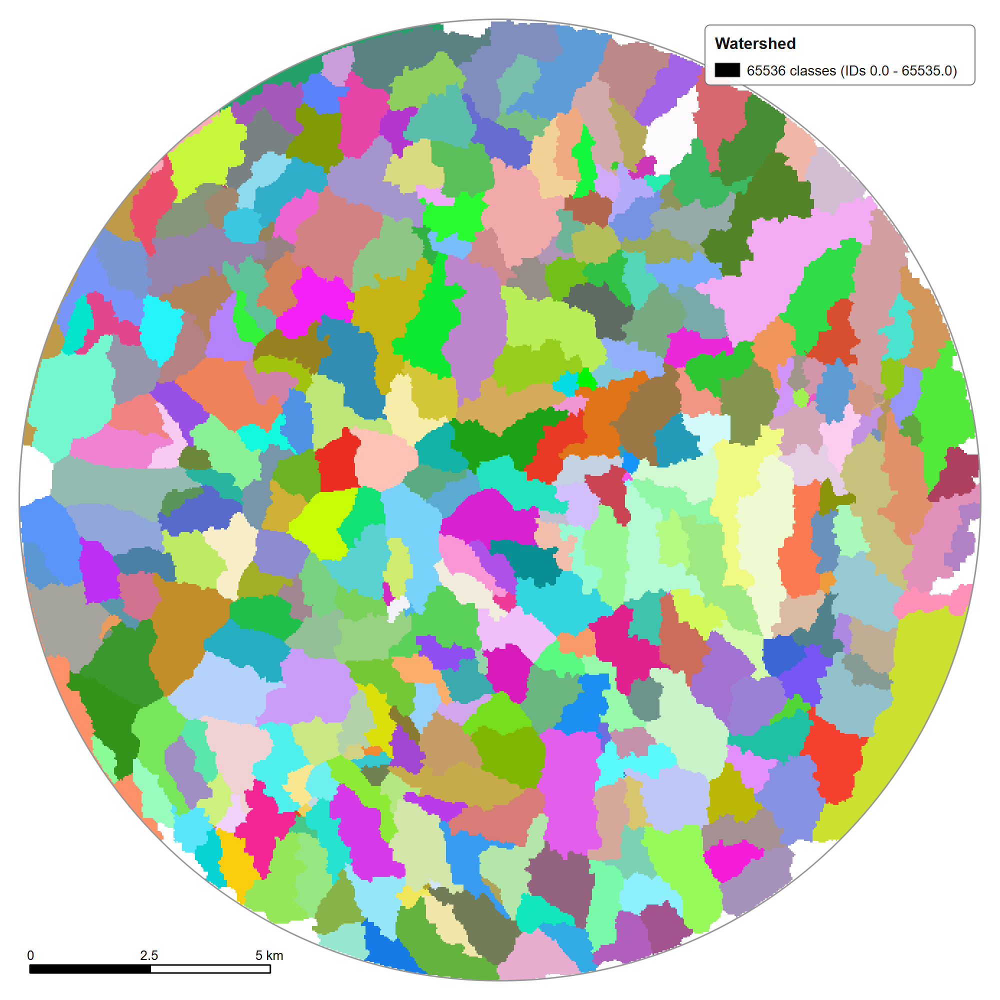

# 🧭 Methodology

## Overview

NagarBadh Drishtm combines geospatial analysis, hydrological modelling, drainage representation, hydraulic simulation and decision-support layers.

The high-level computational pipeline is:

```text
Input spatial data
      ↓
Terrain modelling
      ↓
Hydrological analysis
      ↓
Drainage representation
      ↓
SWMM hydraulic simulation
      ↓
Flood-depth / inundation products
      ↓
Road-accessibility thresholds
      ↓
PostGIS + Dashboard
```

---

## 1. Spatial inputs

The project uses spatial data to establish the urban modelling environment, including terrain and other GIS layers.

The system uses a predominantly indigenous spatial-data foundation, including an ISRO-derived DEM in the project workflow.

<table><tr><td align="center" valign="top"><br><sub>DEM (UTM 43N), 378 to 729 m</sub></td><td align="center" valign="top"><br><sub>Hillshade</sub></td></tr></table>

---

## 2. Terrain modelling

The terrain stage derives spatial characteristics such as:

- Elevation
- Slope
- Flow direction
- Flow accumulation
- Terrain/hydrological indices
- Watersheds
- Streams and drainage-related features

<table><tr><td align="center" valign="top"><br><sub>Slope (degrees)</sub></td><td align="center" valign="top"><br><sub>Flow direction</sub></td><td align="center" valign="top"><br><sub>Flow accumulation</sub></td></tr></table>

<table><tr><td align="center" valign="top"><br><sub>Streams</sub></td><td align="center" valign="top"><br><sub>Watersheds</sub></td></tr></table>

---

## 3. Hydrological / risk modelling

Terrain and hydrological outputs are translated into spatial indicators related to water movement, ponding susceptibility, waterlogging and flood risk.

The resulting layers become inputs to downstream analysis and decision-support products.

<table><tr><td align="center" valign="top"><br><sub>Topographic wetness index</sub></td><td align="center" valign="top"><br><sub>Ponding susceptibility class</sub></td><td align="center" valign="top"><br><sub>Waterlogging risk index (1 to 5)</sub></td></tr></table>

---

## 4. Drainage representation

The drainage stage represents the urban drainage system as a computational network.

The current project documentation includes:

- Drainage conduits
- Nodes
- Outfalls
- Retention ponds
- Intervention-related spatial layers

The model contains **28,370 drainage conduit segments**.

<table><tr><td align="center" valign="top"><br><sub>Drainage design (Fixed v2)</sub></td><td align="center" valign="top"><br><sub>Outfall points</sub></td><td align="center" valign="top"><br><sub>Retention ponds</sub></td></tr></table>

---

## 5. Hydraulic simulation

The drainage network is simulated using **EPA SWMM 5.2.4**, with PySWMM used in the computational workflow.

Relevant outputs include:

- Node depth
- Link flow
- Surcharge/flooding behaviour

The engineering workflow includes iterative diagnosis and correction of numerical instability rather than treating simulation output as automatically valid.

<table><tr><td align="center" valign="top"><br><sub>SWMM V7 (3 h): links by max depth / full depth, nodes by status</sub></td><td align="center" valign="top"><br><sub>SWMM V7 node status</sub></td></tr></table>

<sub>SWMM run V7 (3 h). Per the export notes the run has 25,232 links and 14,109 nodes, with 6 flooded and 60 surcharged nodes.</sub>

---

## 6. Inundation representation

Hydraulic outputs are connected back to the GIS environment to create spatial flood-depth and inundation-oriented products.

<table><tr><td align="center" valign="top"><br><sub>Flood depth (m), 0.02 to 1.58 m</sub></td></tr></table>

---

## 7. Road accessibility

Flood depth is translated into road-impact layers using:

- 0.15 m
- 0.30 m
- 0.50 m

thresholds.

This turns raw depth into an operationally understandable road-accessibility representation.

<table><tr><td align="center" valign="top"><br><sub>Impassable at 0.15 m</sub></td><td align="center" valign="top"><br><sub>Impassable at 0.30 m</sub></td><td align="center" valign="top"><br><sub>Impassable at 0.50 m</sub></td></tr></table>

---

## 8. Data infrastructure

The system uses:

- PostgreSQL
- PostGIS
- QGIS / PyQGIS

for structured spatial data management and integration of modelling outputs.

---

## 9. Dashboard

The outputs are exposed through the repository's interactive web dashboard.

See [Dashboard Documentation](dashboard.md).

---

## Scope note

The methodology describes the broader current system.

The associated manuscript documents only the research scope represented in that manuscript and should not be treated as a complete record of all later SWMM, inundation, road-accessibility and nowcasting development.
